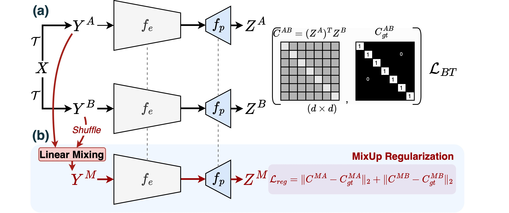

# Mixed Barlow Twins
[**Guarding Barlow Twins Against Overfitting with Mixed Samples**](https://arxiv.org/pdf/)<br>
[Wele Gedara Chaminda Bandara](https://www.wgcban.com) (Johns Hopkins University), [Celso M. De Melo](https://celsodemelo.net) (U.S. Army Research Laboratory), and [Vishal M. Patel](https://engineering.jhu.edu/vpatel36/) (Johns Hopkins University) <br>



## Usage
### Requirements

Before using this repository, make sure you have the following prerequisites installed:

- [Anaconda](https://www.anaconda.com/download/)
- [PyTorch](https://pytorch.org)

You can install PyTorch with the following command:
```bash
conda install pytorch torchvision cudatoolkit=10.0 -c pytorch
```

### Installation

To get started, clone this repository:
```bash
git clone https://github.com/wgcban/mix-bt.git
```

Next, create the Conda environment named `ssl-aug` by executing the following command:
```bash
conda env create -f environment.yml
```

### Supported pre-training datasets

This repository supports the following pre-training datasets:
- `CIFAR-10`: https://www.cs.toronto.edu/~kriz/cifar.html
- `CIFAR-100`: https://www.cs.toronto.edu/~kriz/cifar.html
- `Tiny-ImageNet`: https://github.com/rmccorm4/Tiny-Imagenet-200
- `STL-10`: https://cs.stanford.edu/~acoates/stl10/
- `ImageNet`: https://www.image-net.org

`CIFAR-10`, `CIFAR-100`, and `STL-10` datasets are directly available in PyTorch. 

To use `TinyImageNet`, please follow the preprocessing instructions provided in the [TinyImageNet-Script](https://gist.github.com/moskomule/2e6a9a463f50447beca4e64ab4699ac4). Download these datasets and place them in the `data` directory.

### Supported transfer learning datasets:
You can download and place transfer learning datasets under their respective paths, such as 'data/DTD'. The supported transfer learning datasets include:
- `DTD`: https://www.robots.ox.ac.uk/~vgg/data/dtd/ 
- `MNIST`: http://yann.lecun.com/exdb/mnist/
- `FashionMNIST`: https://github.com/zalandoresearch/fashion-mnist
- `CUBirds`: http://www.vision.caltech.edu/visipedia/CUB-200-2011.html
- `VGGFlower`: https://www.robots.ox.ac.uk/~vgg/data/flowers/102/
- `Traffic Signs`: https://benchmark.ini.rub.de/gtsdb_dataset.html
- `Aircraft`: https://www.robots.ox.ac.uk/~vgg/data/fgvc-aircraft/

### Supported SSL Methods

This repository supports the following Self-Supervised Learning (SSL) methods:

- [`SimCLR`](https://arxiv.org/abs/2002.05709): contrastive learning for SSL 
- [`BYOL`](https://arxiv.org/abs/2006.07733): distilation for SSL
- [`Witening MSE`](http://proceedings.mlr.press/v139/ermolov21a/ermolov21a.pdf): infomax for SSL
- [`Barlow Twins`](https://arxiv.org/abs/2103.03230): infomax for SSL
- **`Mixed Barlow Twins (ours)`**: infomax + mixed samples for SSL

### Pre-Training with Mixed Barlow Twins
To start pre-training and obtain k-NN evaluation results for Mixed Barlow Twins on `CIFAR-10`, `CIFAR-100`, `TinyImageNet`, and `STL-10`, please run:
```bash
sh scripts-pretrain/[dataset].sh
```

### Linear Evaluation of Pre-trained Models
Before running linear evaluation, ensure that you specify the model_path argument correctly in the corresponding .sh file. To obtain linear evaluation results on `CIFAR-10`, `CIFAR-100`, `TinyImageNet`, `STL-10`, and `ImageNet`, please run:
```
sh scripts-linear/[dataset].sh
```

### Transfer Learning of Pre-trained Models
To perform transfer learning from pre-trained models on `CIFAR-10`, `CIFAR-100`, and `STL-10` to fine-grained classification datasets, execute the following command, making sure to specify the `model_path` argument correctly:
```bash
sh scripts-transfer-resnet18/[dataset]-to-x.sh
```

### Pre-Trained Checkpoints
Download the pre-trained models from [GitHub (Releases v1.0.0)](https://github.com/wgcban/mix-bt/releases/tag/v1.0.0) and store them in `checkpoints/`. This repository provides pre-trained checkpoints for both `ResNet-18` and `ResNet-50` architectures.

#### ResNet-18
| Dataset        |  d   | Lambda_BT | Lambda_Reg | Path to Pretrained Model | KNN Acc. | Linear Acc. |
| ----------     | ---  | ---------- | ---------- | ------------------------ | -------- | ----------- |
| `CIFAR-10`       | 1024 | 0.0078125  | 4.0        | [4wdhbpcf_0.0078125_1024_256_cifar10_model.pth](https://github.com/wgcban/mix-bt/releases/download/v1.0.0/4wdhbpcf_0.0078125_1024_256_cifar10_model.pth)     | 90.52    | 92.58        |
| `CIFAR-100`     | 1024 | 0.0078125  | 4.0        | [76kk7scz_0.0078125_1024_256_cifar100_model.pth](https://github.com/wgcban/mix-bt/releases/download/v1.0.0/76kk7scz_0.0078125_1024_256_cifar100_model.pth)     | 61.25     | 69.31        |
| `TinyImageNet`   | 1024 | 0.0009765  | 4.0        | [02azq6fs_0.0009765_1024_256_tiny_imagenet_model.pth](https://github.com/wgcban/mix-bt/releases/download/v1.0.0/02azq6fs_0.0009765_1024_256_tiny_imagenet_model.pth)     | 38.11    | 51.67        |
| `STL-10`        | 1024 | 0.0078125  | 2.0        | [i7det4xq_0.0078125_1024_256_stl10_model.pth](https://github.com/wgcban/mix-bt/releases/download/v1.0.0/i7det4xq_0.0078125_1024_256_stl10_model.pth)     | 88.94     | 91.02        |

#### ResNet-50
| Dataset        |  d   | Lambda_BT | Lambda_Reg | Path to Pretrained Model | KNN Acc. | Linear Acc. |
| ----------     | ---  | ---------- | ---------- | ------------------------ | -------- | ----------- |
| `CIFAR-10`       | 1024 | 0.0078125  | 4.0        | [v3gwgusq_0.0078125_1024_256_cifar10_model.pth](https://github.com/wgcban/mix-bt/releases/download/v1.0.0/v3gwgusq_0.0078125_1024_256_cifar10_model.pth)     | 91.39     | 93.89        |
| `CIFAR-100`      | 1024 | 0.0078125  | 4.0        | [z6ngefw7_0.0078125_1024_256_cifar100_model.pth](https://github.com/wgcban/mix-bt/releases/download/v1.0.0/z6ngefw7_0.0078125_1024_256_cifar100_model.pth)     | 64.32     | 72.51        |
| `TinyImageNet`   | 1024 | 0.0009765  | 4.0        | [kxlkigsv_0.0009765_1024_256_tiny_imagenet_model.pth](https://github.com/wgcban/mix-bt/releases/download/v1.0.0/kxlkigsv_0.0009765_1024_256_tiny_imagenet_model.pth)     | 42.21     | 51.84        |
| `STL-10`        | 1024 | 0.0078125  | 2.0        | [pbknx38b_0.0078125_1024_256_stl10_model.pth](https://github.com/wgcban/mix-bt/releases/download/v1.0.0/pbknx38b_0.0078125_1024_256_stl10_model.pth)     | 87.79     | 91.70        |
| `ImageNet`       | 1024 | 0.0051  | 0.1        | [13awtq23_0.0051_8192_1024_imagenet_0.1_resnet50.pth](https://github.com/wgcban/mix-bt/releases/download/v1.0.0/13awtq23_0.0051_8192_1024_imagenet_0.1_resnet50.pth)     | -     | 72.1        |

### Disclaimer
A large portion of the code is from [Barlow Twins HSIC](https://github.com/yaohungt/Barlow-Twins-HSIC) (for experiments on small datasets: Cifar10, Cifar100, TinyImageNet, and STL-10) and official implementation of Barlow Twins [here](https://github.com/facebookresearch/barlowtwins) (for experiments on ImageNet), which is a great resource for academic development.

Also, note that the implementation of SOTA methods (SimCLR, BYOL, and Witening-MSE) in `ssl-sota` are copied from [Witening-MSE](https://github.com/htdt/self-supervised).

We would like to thank all of them for making their repositories publicly available for the research community.

### Reference
Please consider citing our work, if you feel our work is useful in your work. Thanks.
```
```
